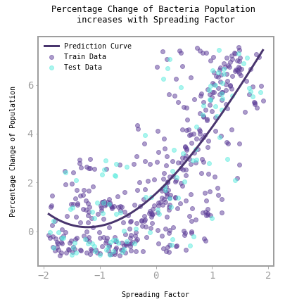
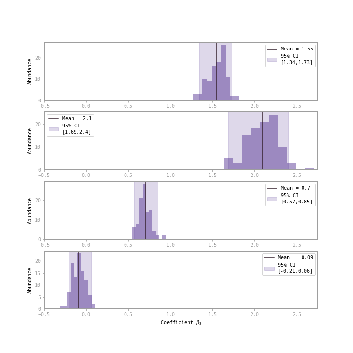
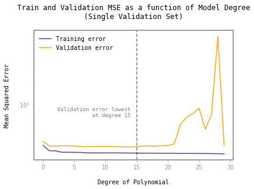
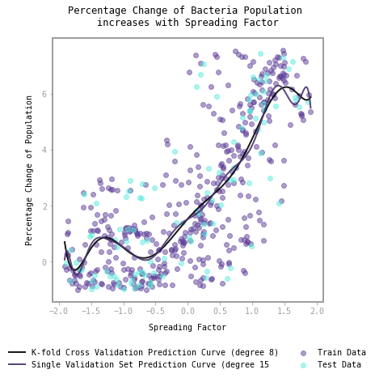
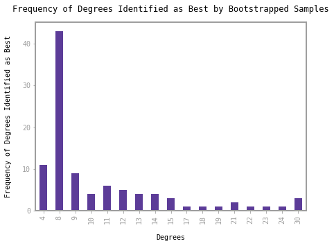
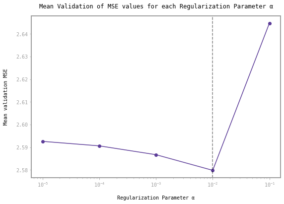
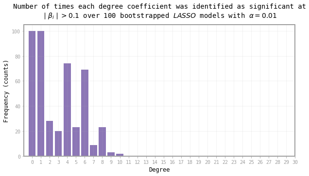
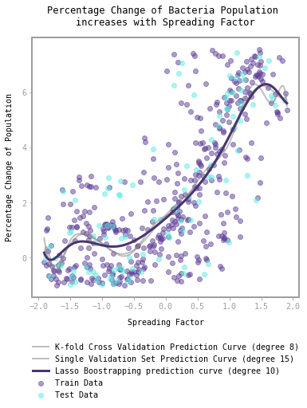
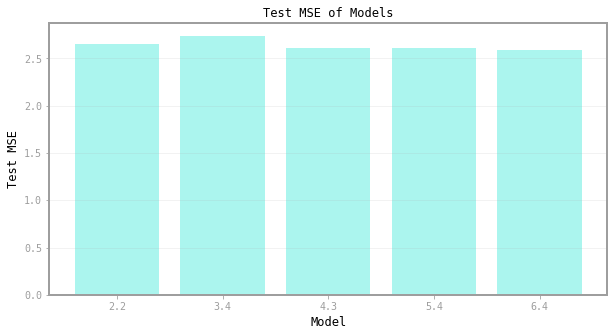

# Predicting Bacterial Population Growth

The goal of this assignment was to build regression models to predict the precent change in bacteria population after 4 hours based on their “spreading factor.” In this exercise, we consider the `spreading_factor ` to be our predictor variable and `perc_population` to be our response variable. We explore several different approaches, with mean squared error (MSE) as our evaluative criteria to find the best fit and most robust polynomial regression to model the relationship.

**Skills:** LASSO regularization, polynomial regression, model selection, hyperparameter tuning, data visualization  
**Tools:** scikit-learn

**Assignment outline:**
1. Guess best degree polynomial (3), fit to model
2. Calculate confidence intervals of coefficients
3. Find best-degree polynomial using a single validation set (illustrate overfitting)
4. Find best-degree polynomial using k-fold cross-validation
5. Find best-degree polynomial using k-fold cross validation with bootstraps
6. Improve model consistency with LASSO regularization  
     a. Use cross-validation to find regularization hyperparameter, alpha  
     b. Bootstrapping to find “most significant” set of polynomial degrees

---

We begin by visualizing the predictor and response variable in a simple scatter plot. Based on a visual inspection of the data, we estimate the degree of a polynomial that would best fit the training data while still generalizing well. The data are shown to the left, with a fitted degree-3 polynomial. 

  

Next, we use 100 bootstrapped samples to __generate 95% confidence intervals for the model coefficients__ by refitting the model to each bootstrapped sample of the training data. The bootstrapped coefficients are shown as a grid of histograms below. The histograms reveal that mean $\beta_i$ values that are very similar to the corresponding $\beta_i$ values identified in our original degree-3 polynomial model. 

  

Boostrapped coefficients are distributed roughly normally around their means. The histograms reveal that mean $\beta_i$ values that are very similar to the corresponding $\beta_i$ values identified in our original degree-3 polynomial model.

Ideally, regression models contain coefficients that are clearly positive or negative for each predictor to affirm that the model has found evidence in support of a clear relationship among each predictor and the response variable. The histograms show that the confidence intervals for $\beta_0$, $\beta_1$, and $\beta_2$ coefficients exclude $\beta_i = 0$.

The data thus show that it is extremely unlikely that there is no relationship between our $x_0$, $x_1$, and $x_2$ (degree-polynomial transformations of the spreading factor variable) and our response variable (percentage change). However, there is not sufficient evidence for us to make the same conclusion for $x_3$ given that the confidence interval for the $\beta_3$ coefficient includes 0. 

Next, we explore further by finding the best degree polynomial relationship using a single validation set. We fit polynomial regression models for degrees 1 to 30 and store the train and validation MSE values for each model. The best degree is determined to be 15 via lowest validation MSE, as shown in the graph below. 

  

We make our model refinement process more robust by using k-fold cross validation to determine the best degree polynomial relationship. We use 10 fold cross validation and iterate over degrees from 1 to 30. The model that yields the lowest mean validation MSE has degree 8. This less flexible lower-order degree-8 model less affected by the noise in our training data. The estimation is more robust because cross validation reduces the effect of random variability on our selection procedure; individual random states of our single train-validation split don't have a disproportionately large effect on our final "best degree" result. We hope that incorporating cross validation into identifying the optimal "best degree" enables the resulting model to generalize well to new data.

We plot both the degree-15 model, identified by the single validation set, and the degree-8 model, identified by k-fold cross validation, onto the train and test data. As previously described, the graph visualizes how using only 1 validation set can result in overfitting which can be addressed with cross-validation.

  

Furthermore, we use bootstrapping to test the robustness of our cross-validation-estimated best degree. We use cross validation to find the best degree polynimial for 100 bootstrapped samples. The results are plotted in a bar graph below. 

  

Indeed, degree-8 polynomials stand out as having been identified as "best" for a clear plurality of our 100 boostraps. We can therefore easily identify degree-8 as our overall best degree. (If this boostrapping method didn't present an extreme plurality of one degree, we would still select the degree with the most frequently identified "best" degree value.) 

Next, we improve model consistency with LASSO regularization. Previous models compared polynomial models of degree $n$ in which we considered all polynomial coefficients up to and including degree $n$. Using regularization, we will consider polunomial features of $n=30$ in which we can construct our best model with any possible combination of our 30 degrees. LASSO regularization "zeroes" highly unstable degree coefficients by reducing them to small values close to zero. 

First, we use cross-validation to find regularization hyperparameter, alpha from $\alpha \in [10^{-5}, 10^{-4}, 10^{-3}, 10^{-2},10^{-1}]$. We select the best $\alpha$ via lowest mean validation MSE values.

  

Now we utilize the identified $\alpha = 10^{-2}$ to find the “most significant” set of polynomial degrees through bootstrapping. For each bootstrap of the data, LASSO regularization identifies significant degrees — we count which degree coefficients are significant over 100 bootstrapped iterations with $n=30$ polynomial features. 

  

We interpret this barplot to mean that degrees below 10 (inclusive) are important for capturing the underlying relationship between the predictor and response variables. Our final "best degree" model thus uses `PolynomialFeatures` to generate degree-polynomial transformations of the spreading factor variable up to degree 10, then implements LASSO regularization with $\alpha = 10^{-2}$ to reduce unstable coefficients. 

**Final Model Comparison**

  

Notice how our final LASSO regularized model is less affected by the noise of the training data when compared to single validation and cross validation-optimized models. A comparison of test MSEs identifies the degree-6 LASSO-regularized model as best. Based on our selection method, this model also seems the most "reliable" or robust in terms of generalization. (Note that the numbers on the MSE graph refer to sections of the assignment.) A potential drawback of this model is its computational complexity and time, as the model took a few minutes despite the small dataset. Regardless, the method was not computationally prohibitive and the resulting model performed well on our test set when balancing model flexibility and simplicity.

  

